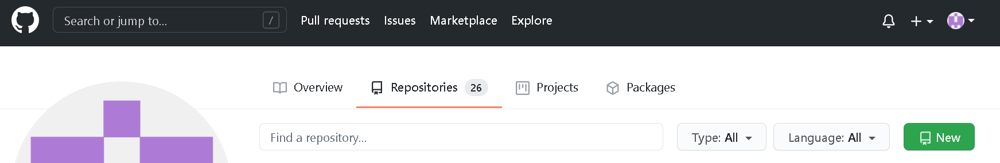

# Python TDD Task
- create a new repo on github
- create a new project on pycharm 
    - if using VSC create new folder 
- name tdd_test_task
- create a file to write tests
- create a file to write code
- implemment pseudo coding
- create a README.md to document the steps to successully achieve the task
- create a test: the check is the number has remainder 0 (divisible by a number) if false fail
- create a class and method to write code to pass the test
- create a test to check if 13.6  

## Pre-Requisites
__Necessary:__ You must have python installed.  
__Optional:__ It is easier to complete this task when using a code editor, such as Visual Studio Code or PyCharm. You can learn how to [install VSC](https://docs.microsoft.com/en-us/visualstudio/install/install-visual-studio?view=vs-2019) or [install PyCharm](https://www.jetbrains.com/help/pycharm/quick-start-guide.html) using these hyperlinks. You also need a GitHub account that is authorised using SSH. Please click [here](https://github.com/Farah-H/Engineering_74/tree/main/business/git_basics) to learn how to set this up.

## Steps: 
### 1. Create a new repository on GitHub: 
Click on the green 'New' button and follow the steps to name your repository. Don't tick / untick anything, just make an empty repo for now. 

### 2. Create a folder for the task:
#### PyCharm:
If you are using PyCharm you can click file (top left) -> New Project -> after `PyCharmProjects\`write the name of the new files, in this case we'll call it `python_TDD_task`

You also need to create a `.gitignore`file and in it write:
```
\venv\
.idea\
```
#### Other Code Editors:
If you are using another code editor, e.g Visual Studio Code, you should be able to just create a folder with the same name wherever you want. 
### 3. In your folder create two files: 

Call them `test_something.py` and `something.py`
###  4. In our `test_` folder, import the necessaey modules and define a testing class, which is a child of `unittest.TestCase`
```python
# importing necessary modules and files
from divisible_class import Divisible
# this class doesn't exist yet, so make sure when you make it you stick to this naming convention
import unittest
import pytest

# defining testing class, which is a child of unittest.TestCase
class TestDivisible(unittest.TestCase):

    # instantiating the Divisible class so we can test it
    divisible_instance = Divisible()


    # test fails if the function returns false, when 5 is indeed a multiple of 10. 
    def test_divisible(self):
        self.assertEqual(self.divisible_instance.divisible(10,5), True)
```
### 5. In our code file, make the class and its method which we would like to pass the tests with:

```python
# defining a class 
class Divisible:

    # function returns True is b is a multiple of a (if a is divisible by b)
    def divisible(self, a, b):
        return a % b == 0 
```

### 6. Run the test:
In your terminal input `python -m pytest` which should return the following output:


### 7. Create a README.md file and write out the steps for task completion. 

You can do this in terminal using `touch README.md` or just using file explorer, make sure to set file type as `Markdown`. 

### 8. Upload to GitHub:
Go to the repository homepage on GitHub.com, You should see this:


Copy and paste the line starting with `git remote .. `into your terminal. 

then type (one at a time):
```bash
git add . 
git commit -m "your comment"
git push -u origin master
```
